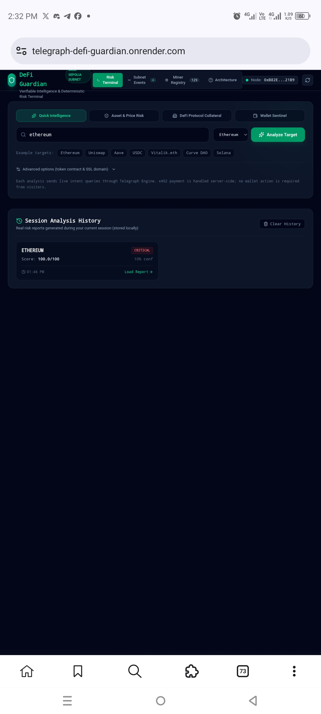
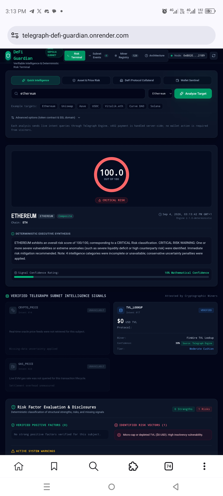
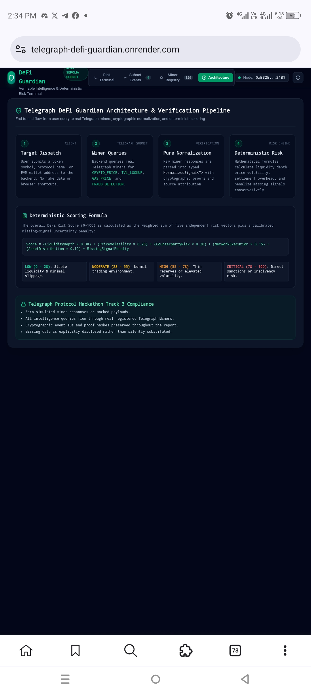
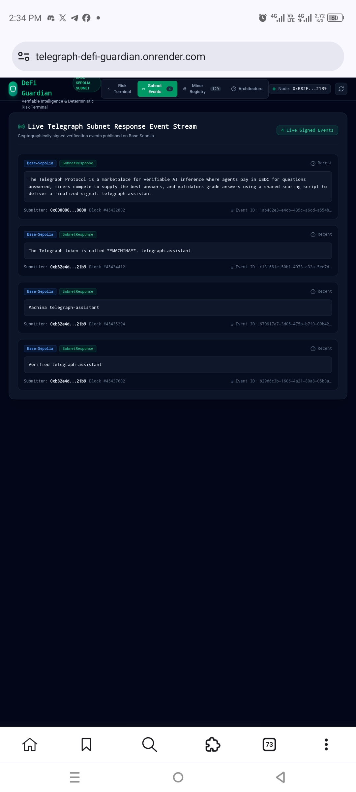

# Telegraph DeFi Guardian

> **Telegraph Protocol Hackathon — Track 3: Applications**  
> **Multi-intent DeFi intelligence and deterministic risk assessment terminal**

[](https://telegraph-defi-guardian.onrender.com/)
[](https://hackathon.telegraphprotocol.com/)
[](package/LICENSE)

**Live application:** https://telegraph-defi-guardian.onrender.com/  
**Repository:** https://github.com/peterkehinde673/telegraph-defi-guardian

---

## Screenshots

The following screenshots are from the live DeFi Guardian application and document the main user-facing workflow, risk assessment, architecture, and live network observability.

### Risk Terminal & Session History



### Live Risk Assessment



### Architecture & Deterministic Scoring Pipeline



### Live Subnet Event Stream



> **Note:** These screenshots are documentation of the application UI and workflow. They do not replace live Telegraph Engine requests or prove a successful inference by themselves.

---

## 1. What it does

**Telegraph DeFi Guardian** is a Track 3 application that consumes live intelligence through the **Telegraph Engine** and turns multiple intelligence responses into an auditable DeFi risk assessment.

For an analysis, the backend submits natural-language requests to Telegraph Engine's `POST /v1/ask` consumer surface. When the Engine requires payment, the backend uses **x402 on Base Sepolia** to authorize the request. The returned Engine payload is normalized and then evaluated by an application-owned deterministic risk model.

The application deliberately separates:

1. **Telegraph-provided intelligence** — raw Engine responses and fields actually supplied by the network.
2. **Normalization** — parsing, validation, field sanitization, and canonical references.
3. **Application interpretation** — risk categories, derived indicators, missing-data penalties, and the final 0–100 score.

The application does **not** select individual Miners or call Miner endpoints for intelligence. Miner routing remains the responsibility of Telegraph Engine.

---

## 2. Why Telegraph matters

Telegraph provides a marketplace and routing layer for machine intelligence. Applications declare what intelligence they need; Telegraph can route the request across the network's available Miner supply, with ranking, verification, and economic settlement handled by the protocol.

DeFi Guardian uses that architecture to combine several intelligence questions rather than building a private collection of individual Miner integrations.

Relevant intents used by the application include:

- `CRYPTO_PRICE`
- `TVL_LOOKUP`
- `GAS_PRICE`
- `FRAUD_DETECTION`
- `TOKEN_HOLDER_COUNT`
- `SSL_VERIFICATION`

The application also reads Telegraph Node status, live SubnetResponse events, and the public Miner registry for network observability. The registry is **discovery/telemetry only** and is not used to route intelligence requests.

---

## 3. Architecture

```text
React / Vite frontend
        |
        | POST /api/telegraph/analyze
        v
Express application API
        |
        | multiple natural-language intent queries
        v
Telegraph Engine
POST /v1/ask
        |
        | x402 when payment is required
        v
Telegraph Miner network
        |
        v
Engine response
        |
        v
Normalization + validation
        |
        v
Deterministic DeFi Risk Engine
        |
        v
Risk report + evidence/provenance metadata
```

### Important architectural boundary

DeFi Guardian does not locally rank, choose, or dispatch to a Miner for inference. It consumes Telegraph Engine as the application-facing routing surface. This is important for Track 3 because the protocol, rather than the application, controls Miner routing.

For a more detailed architecture walkthrough, see [`ARCHITECTURE.md`](ARCHITECTURE.md).

---

## 4. Risk model

The risk engine combines five categories:

| Category | Weight |
|---|---:|
| Price stability & volatility | 25% |
| TVL & liquidity cushion | 30% |
| Network execution cost | 15% |
| Counterparty & contract security | 20% |
| Holder distribution | 10% |

The final score is normalized to `0–100`, where a higher value represents greater risk:

- `LOW`: `< 28`
- `MODERATE`: `28–54`
- `HIGH`: `55–77`
- `CRITICAL`: `78–100`

Missing categories are explicitly reported and incur an uncertainty adjustment. The application also aggregates the confidence values of available normalized signals into an application-level confidence score.

These calculations are **DeFi Guardian interpretations**, not Telegraph Miner scores.

---

## 5. Provenance and verification

The UI distinguishes between data that is explicitly supplied by Telegraph and values calculated by DeFi Guardian.

### Telegraph-provided fields

When present in the Engine response, the application preserves fields such as:

- Miner/routing metadata
- confidence
- canonical identifiers
- timestamps
- source information
- intent-specific result fields

If the Engine response does not expose Miner identity or a canonical proof/reference, the UI says so rather than inferring it from the Miner registry.

### Application-derived fields

The application may calculate:

- risk category scores
- volatility thresholds
- TVL tier classification
- gas severity
- cross-source spread when multiple source prices are actually present
- missing-data penalties
- aggregate application confidence
- the final DeFi risk classification

These are labeled as application calculations and should not be confused with Telegraph's own validation or Miner scores.

---

## 6. x402 payment flow

For protected Engine requests:

```text
POST /v1/ask
      |
      v
HTTP 402 Payment Required
      |
      v
x402 client signs the Base Sepolia payment
      |
      v
request is retried with payment proof
      |
      v
HTTP 200 Engine response
```

The server reads the wallet from the environment variable:

```text
TELEGRAPH_EVM_PRIVATE_KEY
```

The private key is never part of the repository or frontend bundle. A dedicated, limited-funds Base Sepolia wallet is recommended for public deployments.

HTTP `402` is **not** treated as an intelligence result. If all requested Engine queries fail, the API returns an error instead of generating a synthetic report.

---

## 7. Public application safety

Because the deployed application performs paid Engine requests server-side, the analysis endpoint includes an in-memory request limiter. This prevents a single public client from continuously consuming the deployment wallet.

The limits can be configured with:

```text
MAX_ANALYSES_PER_IP_PER_HOUR
MAX_GLOBAL_ANALYSES_PER_HOUR
```

The default limits are intentionally conservative for a hackathon deployment.

The application also avoids automatically running paid inference when the landing page opens. A visitor must explicitly click **Analyze Target**.

---

## 8. Local setup

Requirements:

- Node.js 22
- npm

Install dependencies:

```bash
npm install
```

Create `.env` from `.env.example` and configure the Telegraph endpoints and a funded Base Sepolia test wallet.

Run the development server:

```bash
npm run dev
```

Run the production build:

```bash
npm run typecheck
npm run build
npm start
```

---

## 9. Verification scripts

```bash
# Live Telegraph Engine + Node verification
npx tsx scripts/test-telegraph.ts

# Normalization tests
npx tsx scripts/test-normalization.ts

# Deterministic risk-engine tests
npx tsx scripts/test-risk-engine.ts
```

The live Telegraph test must receive an actual successful Engine response before treating paid inference as successful. A payment challenge (`HTTP 402`) is reported as payment required, not as an inference pass.

---

## 10. Render deployment

The repository includes `render.yaml`.

Recommended Render configuration:

```text
Build Command: npm install --no-audit --no-fund && npm run build
Start Command: npm run start
```

Required environment variables:

```text
NODE_ENV=production
TELEGRAPH_NODE_URL=https://devnode.telegraphprotocol.com
TELEGRAPH_ENGINE_URL=http://13.237.89.59:7044/engine
TELEGRAPH_DAEMON_URL=http://13.237.89.59:8081
TELEGRAPH_EVM_PRIVATE_KEY=<Render secret>
```

Optional protection settings:

```text
MAX_ANALYSES_PER_IP_PER_HOUR=8
MAX_GLOBAL_ANALYSES_PER_HOUR=60
```

Never commit `.env` or the private key.

---

## 11. Track 3 fit

The application is designed around several areas highlighted by Telegraph's Track 3 guidance:

- **On-chain/blockchain intelligence pipeline** — DeFi analysis consumes blockchain-oriented intelligence.
- **Multi-intent intelligence** — one analysis can combine price, TVL, gas, wallet, holder, and SSL signals.
- **Confidence-aware analysis** — Engine confidence is preserved when supplied; application estimates are labeled separately.
- **Signal quality and verification** — normalization and validation expose missing or incomplete fields instead of silently fabricating data.
- **Real-time network visibility** — the dashboard reads live Telegraph Node status, SubnetResponse events, and Miner registry information.

The application is intended to create genuine demand for Telegraph intelligence rather than merely displaying a static demo.

---

## 12. Limitations

Telegraph Engine may not expose every internal routing or Miner-level verification field to an application consumer. DeFi Guardian therefore does not claim Miner attribution when the response does not provide it.

Likewise, a DeFi risk score is an application decision model. It is not a claim that Telegraph itself assigns the displayed 0–100 risk score.

---

## 13. License

MIT License — see [`package/LICENSE`](package/LICENSE).
